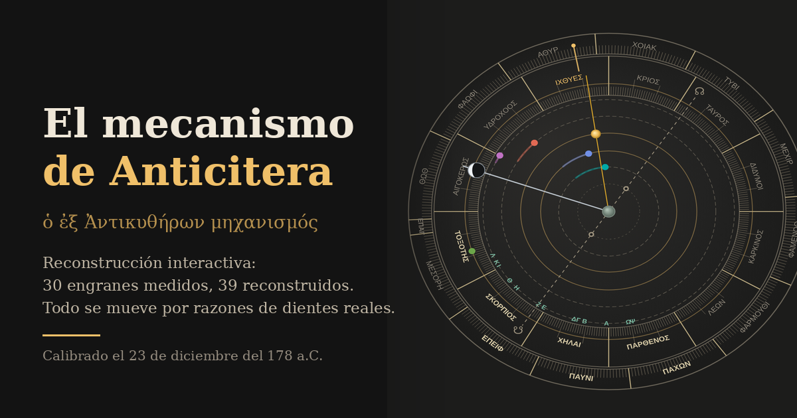

# El mecanismo de Anticitera

Reconstrucción interactiva del mecanismo de Anticitera. Un solo archivo HTML, sin dependencias,
sin red, sin build de framework: se abre y funciona.

**La regla del proyecto: todo lo que se mueve, se mueve porque un tren de engranes reales lo obliga.**
No hay efemérides modernas por debajo. El estado entero de la máquina es un escalar —las vueltas de
la rueda b1— y todo lo demás sale de razones de dientes medidas por tomografía. Por eso los errores
que ves son los del aparato, no los del navegador.



---

## Qué hay dentro

| Vista | Contenido |
|---|---|
| **Frente** | El cosmos geocéntrico: zodiaco en griego, calendario egipcio arrastrable, los cinco planetas con sus lazos retrógrados, el Sol verdadero y la Luna con su esfera de fase |
| **Dorso** | Espiral metónica de 235 celdas con los meses corintios, espiral del Saros de 223 con los 51 glifos de eclipse, dial de los Juegos y exeligmós |
| **Engranajes** | Los 30 engranes que existen, a escala real, con dientes triangulares. Toca una salida y se enciende su tren |
| **Corte** | La tercera dimensión: 41.3 mm de engranaje en una caja de 100, nueve tubos coaxiales con 0.76 mm cada uno, y los bloques epicíclicos cruzando el plano al girar |
| **Letras** | El griego verbatim de la edición de 2016, con las convenciones de Leiden intactas |
| **Trozos** | Los 82 fragmentos a escala: 731 cm² y 895 gramos de bronce en total |

Tres reconstrucciones rivales seleccionables —Freeth 2021, Jones · Wright, Voulgaris 2026— que
cambian los periodos planetarios, la forma de presentarlos y cuántos engranes hay que suponer.

**Se maneja arrastrando sobre la propia máquina**, que es como se usaba el original: se agarra y se
gira. Con ratón el giro es circular y una vuelta completa del cursor equivale a una vuelta de
manivela, es decir 78.6 días. Con el dedo el gesto es horizontal, para no pelearse con el
desplazamiento de la página. Sobre el anillo exterior del calendario el arrastre mueve el anillo, que
era móvil de verdad. Un toque simple selecciona la pieza.

En la vista de engranajes se señala una rueda por **su corona dentada o por su letra**, nunca por el
centro: catorce de las treinta y cuatro ruedas van montadas de a dos, tres o seis sobre el mismo
árbol, así que comparten centro exacto y una diana circular en el eje solo dejaría alcanzar la mayor
de cada grupo. Al seleccionar una rueda se enciende ella y queda a media luz el tren al que
pertenece, porque una rueda sola no significa nada: lo que significa es de quién es compañera.

---

## Evidencia e interpretación

Todo el archivo distingue las dos cosas, y el color lo dice: **oro vivo** = la pieza existe en metal,
**oro pálido** = lo afirma una inscripción, **gris** = reconstruido, **gris punteado** = conjetural.

De los ~69 engranes del modelo completo, **30 sobreviven y 39 están perdidos**. Ningún engrane
planetario sobrevive: la cara frontal entera se infiere de la Inscripción de la Cubierta Posterior
y de una sola rueda suelta de 63 dientes. El dorso es idéntico en las tres reconstrucciones —ahí
está toda la evidencia física—; lo que se discute es el frente.

---

## Tres cosas que salieron de construirlo

No las tomé de ningún artículo; salieron de calcular sobre los datos publicados.

**Venus decide entre los dos modelos planetarios.** En cuarenta años, los periodos de Freeth 2021 y
los babilónicos de año-meta ponen a Venus a **casi veinte grados de distancia** — dos tercios de un
signo zodiacal. Júpiter y Saturno se separan tres décimas de grado en veinte años: indistinguibles
para cualquier observador antiguo. Eso da un argumento funcional, independiente del epigráfico, a
favor del periodo de 462 años: un constructor que hubiera usado (5, 8) habría tenido un Venus
visiblemente equivocado dentro de su propia vida.

**Los cinco planos del dorso son el mínimo teórico.** Tomando los quince grupos de ruedas que deben
ser coplanares y exigiendo que dos ruedas del mismo eje nunca compartan profundidad, el problema es
un coloreado de grafo y su solución mínima es exactamente **5**. El cuello de botella es el árbol e,
con seis ruedas en un solo eje. Y 8.0 mm ÷ 5 = 1.6 mm por plano, que es el paso de capa medido en la
tomografía: el constructor empaquetó el mecanismo en el óptimo combinatorio.

**El patrón grabado de eclipses encaja 65 de 65.** Alineando la Tabla 4.6 de la edición de 2016 con
los eclipses reales de la época de calibración, las 38 celdas lunares y las 27 solares caen **todas**
sobre posibilidades genuinas, con un desfase único. Pero solo funciona si el eclipse lunar va a mitad
de celda y el solar al final; con el orden contrario el ajuste se desploma a cero.

---

## Desarrollo

```bash
npm run build      # src/ → index.html (un solo archivo, ~168 KB)
npm run dev        # construye y sirve en localhost:5173
npm install        # solo si vas a correr las pruebas
npm run check      # las tres pruebas seguidas
```

Las pruebas son tres y ninguna necesita servidor:

| Script | Qué comprueba |
|---|---|
| `scripts/check.mjs` | 3 anchos × 3 modelos × 6 vistas × 82 fragmentos, sin un solo error de consola, más los invariantes del mecanismo: 51 glifos, 38 lunares, 27 solares, 254/19, 235/19, 940/4237 |
| `scripts/jitter.mjs` | Que la caja **no salte**. Recorre 400 fechas midiendo la altura de cada celda: el texto cambia de largo con la fecha, así que si no está reservada la altura, la página entera se mueve mientras la manivela corre |
| `scripts/drag-test.mjs` | Que arrastrar gire exactamente 78.6 días por vuelta, que el anillo del calendario gire sin mover la máquina, que un toque siga seleccionando y que el giro automático se detenga al agarrar |
| `scripts/gear-hit.mjs` | Que **las 34 ruedas se puedan señalar**. Hace 68 clics reales —la letra y la corona de cada una— y exige que cada uno seleccione su propia rueda, no la vecina ni la coaxial; luego barre el lienzo entero comprobando que ninguna quede sin un solo píxel suyo |

`index.html` está versionado a propósito: es el entregable, y así el repo se puede clonar y abrir
sin instalar nada. El código fuente vive en `src/` y `build.mjs` lo concatena en orden.

```
src/core.js      constantes de la máquina, calendario juliano/gregoriano, cinemática
src/render.js    cara frontal, cara posterior, engranajes
src/corte.js     corte axial
src/letras.js    inscripciones, griego verbatim
src/frag.js      los 82 fragmentos
src/ui.js        navegación, lectura, fichas
src/content.js   textos largos
```

## Despliegue

Es un sitio estático. En Vercel: importa el repo y listo — `vercel.json` ya trae el comando de
construcción, las cabeceras de caché y una Content-Security-Policy restrictiva.

```bash
npx vercel --prod
```

---

## Fuentes

- Freeth, T. *et al.*, **«A Model of the Cosmos in the ancient Greek Antikythera Mechanism»**,
  *Scientific Reports* **11**:5821 (2021). Las medidas de los 30 engranes salen de su Tabla
  Suplementaria S8. [Corrección de autor](https://www.nature.com/articles/s41598-021-96382-9) de
  agosto de 2021 para los numerales griegos.
- Freeth, T. & Jones, A., **«The Cosmos in the Antikythera Mechanism»**, *ISAW Papers* **4** (2012).
- Freeth, T. *et al.*, *Nature* **444**:587 (2006) — sus Notas Suplementarias traen el área y el peso
  de los 82 fragmentos, uno por uno: el único conjunto completo que existe.
- Freeth, Jones, Steele & Bitsakis, *Nature* **454**:614 (2008) — dial de los Juegos y predicción de
  eclipses.
- Anastasiou, Bitsakis, Jones, Moussas, Steele, Tselikas & Zafeiropoulou,
  **«Inscriptions of the Antikythera Mechanism»**, *Almagest* **7.1** (2016), pp. 4–312.
  **Todo el griego del archivo sale de aquí, verbatim.**
- Jones, A., *A Portable Cosmos* (Oxford UP, 2017); y PoS(Antikythera & SKA)038 (2012).
- Voulgaris, Mouratidis, Vossinakis & Roumeliotis, *Heritage* **9**(3):95 (2026) — la objeción
  publicada al modelo planetario.
- Woan, G. & Bayley, J., *Horological Journal* (2024) — el recuento de 354 agujeros.
- Szigety, S. & Arenas, A., arXiv:2504.00327 (2025) — el criterio de atascamiento.
- Price, D. de S., *Gears from the Greeks*, TAPS **64**.7 (1974).

---

## Autor

**Raúl Gabino Quilantán** — [WhatsApp +52 834 130 9459](https://wa.me/528341309459)

---

## Licencia

- **Código:** MIT (ver `LICENSE`).
- **Contenido:** CC BY-NC 4.0.

La segunda no es opcional. Las transcripciones griegas están copiadas de *Almagest* 7.1 (2016),
que se publicó bajo **CC BY-NC 4.0**: reproducirlas exige atribución y **excluye el uso comercial**.
Mientras el sitio sea público y no comercial no hay problema; si algún día quisieras monetizarlo,
habría que quitar las transcripciones o pedir permiso a los editores.
